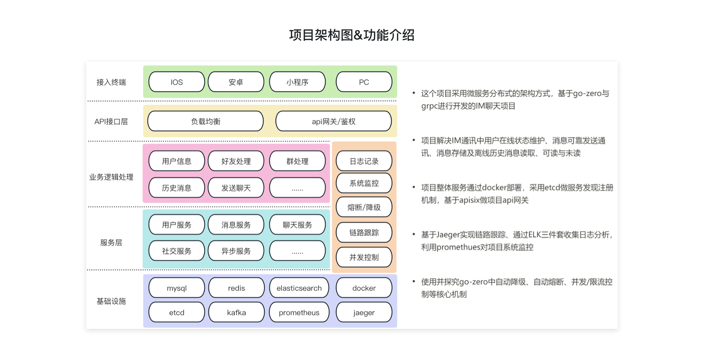
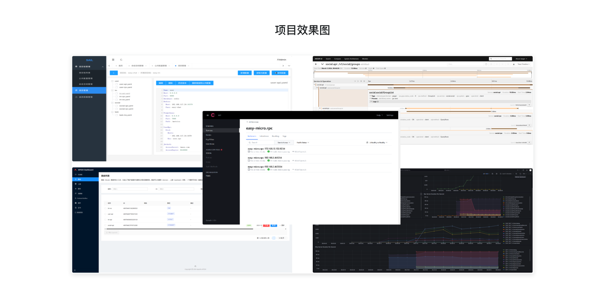

# 💬 EasyChat - 高性能分布式 IM 即时通讯系统

> 🏗️ 基于 Go-Zero 微服务框架构建的企业级即时通讯解决方案，深度实践云原生架构与 DevOps 最佳实践

---

## 📋 项目简介

EasyChat 是一款采用微服务分布式架构的 IM 即时通讯项目，基于 **Go-Zero** 框架与 **gRPC** 协议开发，专注于解决即时通讯场景中的核心技术挑战：

- 🟢 **用户在线状态实时维护** — 基于 WebSocket 长连接的心跳检测机制
- 📨 **消息可靠投递** — 支持消息确认、重试、幂等性保证
- 💾 **消息持久化存储** — MySQL + MongoDB 混合存储策略
- 🔄 **离线消息同步** — 支持历史消息拉取与未读消息计数
- ✅ **消息已读/未读状态** — 精准的消息状态追踪

---

## 🛠️ 技术架构

### 📌 核心技术栈

| 层级 | 技术选型 | 说明 |
|------|----------|------|
| 🏗️ **开发框架** | Go-Zero v1.10 | 微服务 RPC 框架，内置服务治理 |
| 🔗 **通信协议** | gRPC + WebSocket | 高效 RPC 调用 + 实时双向通信 |
| 📡 **服务注册** | etcd | 服务发现与配置中心 |
| 🚪 **API 网关** | Apache APISIX | 流量网关，支持限流、鉴权、路由 |
| 🔍 **链路追踪** | Jaeger | 分布式链路追踪，全链路可观测 |
| 📊 **日志系统** | ELK Stack | Elasticsearch + Logstash + Kibana |
| 📈 **监控告警** | Prometheus + Grafana | 系统指标监控与可视化 |
| 📨 **消息队列** | Kafka | 异步消息处理，削峰填谷 |
| 💾 **数据存储** | MySQL + MongoDB + Redis | 关系型 + 文档型 + 缓存 |
| 🐳 **部署运维** | Docker + Kubernetes | 容器化编排与自动化部署 |

### ✨ 架构设计亮点

- 🛡️ **自动熔断降级**：基于 go-zero 内置的熔断器实现服务自我保护
- ⚡ **自适应限流**：智能流量控制，防止服务雪崩
- 🔄 **分布式事务**：通过消息队列实现最终一致性
- 🚀 **多级缓存策略**：Redis 缓存 + 本地缓存，提升系统吞吐量

---

## 🏛️ 系统架构图



---

## 🖥️ 项目效果图



---

## 📂 项目结构

```
easy-chat/
├── apps/                          # 业务服务层
│   ├── user/                      # 用户服务
│   │   ├── api/                   # HTTP API 网关层
│   │   └── rpc/                   # gRPC 服务层
│   ├── im/                        # 即时通讯服务
│   │   ├── api/                   # IM HTTP 接口
│   │   ├── rpc/                   # IM RPC 服务
│   │   ├── ws/                    # WebSocket 网关
│   │   └── immodels/              # 数据模型层
│   ├── social/                    # 社交关系服务
│   │   ├── api/                   # 社交 API
│   │   ├── rpc/                   # 社交 RPC
│   │   └── socialmodels/          # 社交数据模型
│   └── task/mq/                   # 异步任务处理
├── pkg/                           # 公共组件库
│   ├── constants/                 # 常量定义
│   ├── ctxdata/                   # 上下文数据管理
│   ├── interceptor/               # RPC 拦截器
│   ├── respx/                     # 统一响应封装
│   ├── wuid/                      # 分布式 ID 生成
│   └── xerr/                      # 错误码管理
├── deploy/                        # 部署配置
│   ├── dockerfile/                # Docker 镜像构建
│   ├── make/                      # Makefile 构建脚本
│   ├── script/                    # 部署脚本
│   └── sql/                       # 数据库初始化脚本
└── scripts/                       # 本地启动脚本
```

---

## 🧩 服务模块说明

| 服务 | 模块 | 功能说明 | 端口 |
|------|:----:|----------|:----:|
| 👤 **user** | api | 用户注册、登录、信息查询 | 8080 |
| 👤 **user** | rpc | 用户数据管理、认证服务 | 8081 |
| 💬 **im** | api | 聊天记录查询、会话管理 | 8082 |
| 💬 **im** | rpc | 消息存储、消息状态管理 | 8083 |
| 💬 **im** | ws | WebSocket 实时消息推送 | 8084 |
| 👥 **social** | api | 好友、群组管理接口 | 8085 |
| 👥 **social** | rpc | 社交关系数据服务 | 8086 |
| ⚙️ **task** | mq | 消息消费、异步任务处理 | 8087 |

---

## 🏗️ 本地开发环境搭建

### 📦 前置依赖

| 依赖 | 版本 |
|------|------|
| 🐹 Go | 1.22+ |
| 🐳 Docker & Docker Compose | 最新稳定版 |
| 🔧 Make | GNU Make 4.0+ |
| 📡 etcd | 3.5+ |
| 🗄️ MySQL | 8.0+ |
| 🔴 Redis | 6.0+ |
| 🍃 MongoDB | 5.0+ |
| 📨 Kafka | 3.0+ |

### 🚀 快速启动基础设施

项目依赖的中间件服务可以通过以下仓库快速搭建：

```bash
# 📦 克隆 docker 环境仓库
git clone https://github.com/HeRedBo/dockers.git
cd dockers

# 🐳 启动基础服务（etcd、MySQL、Redis、MongoDB、Kafka 等）
docker-compose up -d
```

### 🖥️ 本地服务启动

```bash
# 1️⃣ 克隆项目
git clone https://github.com/HeRedBo/easy-chat.git
cd easy-chat

# 2️⃣ 下载依赖
go mod tidy

# 3️⃣ 启动服务（基于 air 热加载，确保 Docker 基础服务已先行启动）
```

<details>
<summary>🚀 一键启动全部服务</summary>

```bash
# 启动所有服务（每个模块在独立终端窗口中运行）
chmod +x deploy/scripts/start.sh
./deploy/scripts/start.sh
```

</details>

<details>
<summary>🎯 启动特定服务</summary>

```bash
# 仅启动 user + social 服务
./deploy/scripts/start.sh user social

# 仅启动 im 服务
./deploy/scripts/start.sh im

# 仅启动 task 异步任务
./deploy/scripts/start.sh task
```

</details>

<details>
<summary>🔧 单模块精细启动（补充方式）</summary>

每个脚本会在独立终端窗口中通过 air 启动对应模块：

```bash
# 👤 用户服务
./scripts/start-users-rpc.sh    # User RPC
./scripts/start-users-api.sh    # User API

# 💬 IM 服务
./scripts/start-im-rpc.sh       # IM RPC
./scripts/start-im-api.sh       # IM API
./scripts/start-im-ws.sh        # IM WebSocket

# 👥 社交服务
./scripts/start-social-rpc.sh   # Social RPC
./scripts/start-social-api.sh   # Social API

# ⚙️ 异步任务
./scripts/start-task.sh         # Task MQ
```

</details>

> 💡 **提示**：脚本基于 macOS `osascript` 实现，会在独立终端窗口中通过 [air](https://github.com/cosmtrek/air) 热加载启动服务。Windows 环境请使用 `scripts/` 目录下的 `.bat` 脚本。

---

## 🚢 生产部署指南

### 🐳 镜像构建与推送

项目支持基于阿里云容器镜像服务的自动化构建与部署：

```bash
# 🔍 查看构建配置
make -f deploy/make/build.mk info

# 🔨 构建本地镜像（默认：user rpc dev）
make -f deploy/make/build.mk build

# 🚀 构建并推送镜像到阿里云
make -f deploy/make/build.mk release

# 🎯 指定服务、模块和环境
make -f deploy/make/build.mk build SVR=im MOD=api ENV=prod
```

### 🏷️ 镜像命名规范

```
{服务名}-{模块名}-{环境}
```

> 💡 示例：`user-rpc-dev` · `user-api-prod` · `im-ws-prv` · `social-rpc-test`

### 📖 详细部署文档

更多部署细节请参考 [📋 deploy/README.md](./deploy/README.md)，包含：
- 🌍 多环境配置管理（dev/test/prv/prod）
- ☁️ 阿里云镜像仓库配置
- ☸️ Kubernetes 部署 YAML
- 🔄 CI/CD 流水线配置

---

## 🎯 核心功能特性

### 💬 即时通讯
- [x] 单聊与群聊消息收发
- [x] 消息已读/未读状态追踪
- [x] 历史消息分页查询
- [x] 离线消息推送与同步
- [x] 消息撤回与编辑

### 👥 社交关系
- [x] 好友申请与处理
- [x] 群组创建与管理
- [x] 群成员权限管理
- [x] 在线状态实时感知

### ⚙️ 系统能力
- [x] JWT 身份认证
- [x] 接口限流与熔断
- [x] 分布式链路追踪
- [x] 统一日志收集
- [x] 系统指标监控

---

## 💡 技术思考与实践

### 🤔 为什么选择 Go-Zero？

1. 🏗️ **工程化能力**：内置代码生成、API 定义、服务治理
2. ⚡ **高性能**：基于 gRPC 的高性能 RPC 通信
3. 🔧 **易运维**：内置监控、链路追踪、熔断限流
4. 🌐 **生态丰富**：完善的中间件支持与社区活跃度

### 🧩 IM 系统的技术挑战与解决方案

| 挑战 | 解决方案 |
|------|----------|
| ⚡ 高并发消息推送 | WebSocket 连接池 + 消息队列异步处理 |
| ⏱️ 消息时序一致性 | 基于 Snowflake 的分布式 ID + 时间戳排序 |
| 🔢 未读消息计数 | Redis 原子计数 + 定时持久化 |
| 🔄 多端消息同步 | 消息序号机制 + 增量同步策略 |
| 🛡️ 消息可靠性 | 消息确认机制 + 重试队列 + 死信处理 |

---

## 📄 开源协议

本项目基于 [MIT License](LICENSE) 开源。

---

## 👨‍💻 关于作者

热爱后端技术，专注于分布式系统与云原生架构。欢迎交流技术问题！

---

> 💡 **提示**：本项目为学习与实践项目，持续迭代优化中。如有问题，欢迎提交 Issue 或 PR。
