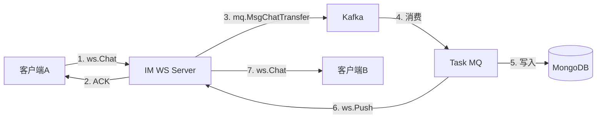
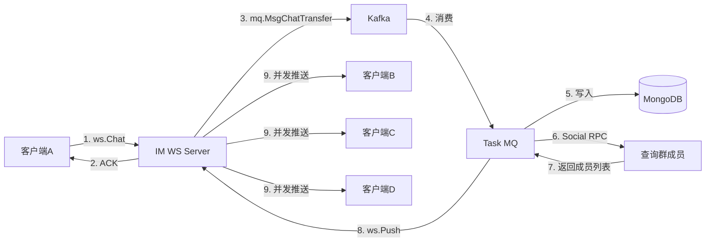
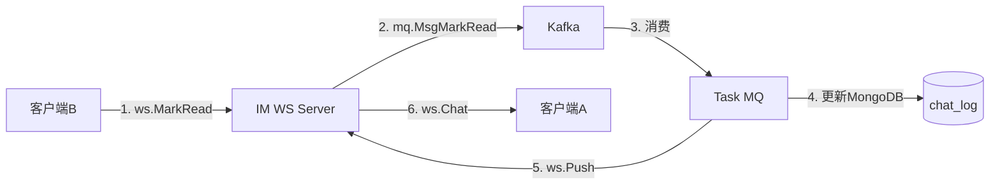
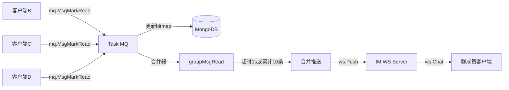

# easy-chat IM 聊天板块数据结构 & 流程梳理

> 本文档梳理 easy-chat 项目中 IM 即时通讯模块（WebSocket + Task MQ）的完整数据链路、交互报文与核心设计巧思。

---

## 一、服务架构与职责

```
┌─────────────┐      WS连接       ┌──────────────┐
│   客户端A   │ ◄──────────────► │   IM WS      │
└─────────────┘                   └──────┬───────┘
                                         │ Kafka Push
                                         ▼
                                  ┌──────────────┐
                                  │   Task MQ    │
                                  └──────┬───────┘
                                         │
                    ┌────────────────────┼────────────────────┐
                    ▼                    ▼                    ▼
              ┌──────────┐       ┌──────────┐       ┌──────────┐
              │ MongoDB  │       │ Social   │       │  IM WS   │
              │ chat_log │       │   RPC    │       │ (回推)   │
              └──────────┘       └──────────┘       └──────────┘
```

| 服务 | 核心职责 | 不做什么 |
|------|---------|---------|
| **IM WS** | WebSocket 连接管理、消息收发、ACK 确认 | 不操作数据库、不查业务 |
| **Task MQ** | 消费 Kafka 消息、持久化到 MongoDB、推送回 WS | 不维护长连接 |
| **Social RPC** | 提供群成员查询等社交能力 | 不处理消息流转 |

---

## 二、核心数据结构（分层梳理）

### 2.1 WebSocket 信封层（通用）

`apps/im/ws/websocket/message.go`

```go
type Message struct {
    FrameType uint8       // 0x0=Data 0x1=Ping 0x2=ACK 0x4=NoAck 0x9=Err
    Id        string      // 消息唯一ID，用于ACK去重
    AckSeq    int         // ACK序号（递增）
    Method    string      // 路由方法：conversation.chat / push / conversation.markChat
    UserId    string      // 目标用户ID
    FormId    string      // 发送方ID
    Data      interface{} // 业务载荷
}
```

### 2.2 客户端发送的业务结构

`apps/im/ws/ws/ws.go`

**发送聊天消息：**
```go
type Chat struct {
    ConversationId string             // 会话ID（为空则服务端自动生成）
    ChatType       constants.ChatType // 1=群聊, 2=私聊
    SendId         string             // 发送者ID
    RecvId         string             // 接收者ID（群聊时为群ID）
    SendTime       int64              // 发送时间戳
    MsgKind        constants.MsgKind  // 服务端生成，客户端无需传递
    Msg            // 嵌套结构
}

type Msg struct {
    MType       constants.MType   // 0=文本
    Content     string            // 消息内容
    MsgId       string            // 消息ID（服务端生成后回填）
    ReadRecords map[string]string // 已读记录 map[msgId]=base64(bitmap)
}
```

**标记已读：**
```go
type MarkRead struct {
    ChatType       constants.ChatType // 1=群聊, 2=私聊
    RecvId         string             // 当前操作用户ID
    ConversationId string
    MsgIds         []string           // 要标记已读的消息ID列表
}
```

### 2.3 内部流转结构（WS → Kafka → Task MQ）

`apps/task/mq/mq/mq.go`

```go
// 聊天消息传输
type MsgChatTransfer struct {
    ChatType       constants.ChatType
    ConversationId string
    SendId         string
    RecvId         string
    RecvIds        []string
    MType          constants.MType
    Content        string
    SendTime       int64
}

// 已读标记传输
type MsgMarkRead struct {
    ChatType       constants.ChatType
    ConversationId string
    SendId         string
    RecvId         string
    MsgIds         []string
}
```

### 2.4 服务端推送结构（内部流转）

`apps/im/ws/ws/ws.go`

```go
type Push struct {
    ChatType       constants.ChatType    // 1=群聊, 2=私聊
    ConversationId string
    SendId         string
    RecvId         string
    RecvIds        []string              // 群聊接收者列表
    SendTime       int64
    MType          constants.MType
    MsgId          string
    ReadRecords    map[string]string
    ContentType    constants.ContentType // 0=聊天, 1=已读（内部使用）
    MsgKind        constants.MsgKind     // 0=聊天, 1=已读回执, 2=撤回, 3=系统通知
    Content        string
}
```

### 2.5 MongoDB 存储结构

`apps/im/immodels/chatlogtypes.go`

```go
type ChatLog struct {
    ID             bson.ObjectID
    ConversationId string
    SendId         string
    RecvId         string
    MsgFrom        int
    ChatType       constants.ChatType
    MsgType        constants.MType
    MsgContent     string
    SendTime       int64
    Status         int
    Day            int
    ReadRecords    []byte   // 已读记录: 私聊=[1], 群聊=bitmap字节
    UpdateAt       time.Time
    CreateAt       time.Time
}
```

`apps/im/immodels/conversationtypes.go`

```go
type Conversation struct {
    ID             bson.ObjectID
    ConversationId string
    ChatType       constants.ChatType
    IsShow         bool
    Total          int      // 总消息数
    Seq            int64    // 序列号
    Msg            *ChatLog // 最新消息快照
    UpdateAt       time.Time
    CreateAt       time.Time
}
```

### 2.6 类型常量定义

`pkg/constants/im.go`

```go
type MType int
const (
    TextMType MType = iota   // 0 = 文本
)

type ChatType int
const (
    GroupChatType ChatType = iota + 1  // 1 = 群聊
    SingleChatType                      // 2 = 私聊
)

type ContentType int
const (
    ContentChatMsg ContentType = iota   // 0 = 聊天消息
    ContentMakeRead                     // 1 = 已读标记
)

type MsgKind int
const (
    MsgKindChat    MsgKind = iota  // 0 = 普通聊天消息
    MsgKindReadAck                  // 1 = 已读回执
    MsgKindRevoke                   // 2 = 消息撤回（预留）
    MsgKindSystem                   // 3 = 系统通知（预留）
)
```

---

## 三、数据流程链路

### 3.1 私聊消息发送



**关键步骤：**
1. 客户端A发送 `conversation.chat`，`Data` 为 `ws.Chat`
2. 若 `ConversationId` 为空，服务端通过 `wuid.CombineId(recvId, sendId)` 生成固定双向会话ID
3. WS Server 将消息推入 Kafka（`MsgChatTransfer`），立即返回 ACK
4. Task MQ 消费后：生成 `bson.NewObjectID()` 作为 `MsgId`，写入 `chat_log`，更新 `conversation`
5. 调用 `BaseMsgTransfer.single()` 向 WS Server 发送 `push` 指令
6. WS Server `push.go` 的 `single()` 通过 `GetConn(recvId)` 查找在线连接，转发 `ws.Chat`

### 3.2 群聊消息发送



**与私聊的差异：**
- 群聊的 `ConversationId` 直接等于 `RecvId`（即 `GroupId`）
- Task MQ 通过 **Social RPC** 查询群成员列表，排除发送者后填充 `RecvIds`
- `push.go` 的 `group()` 使用 `TaskRunner.Schedule()` 并发推送给所有在线成员

### 3.3 消息已读（私聊）



### 3.4 消息已读（群聊 - 合并优化）



---

## 四、客户端 JSON 报文交互

### 4.1 客户端发送

**发送私聊消息：**
```json
{
  "frame_type": 0,
  "id": "client_msg_001",
  "method": "conversation.chat",
  "data": {
    "conversation_id": "",
    "chat_type": 2,
    "send_id": "user_10086",
    "recv_id": "user_10087",
    "msg": {
      "m_type": 0,
      "content": "你好，在吗？"
    }
  }
}
```

**发送群聊消息：**
```json
{
  "frame_type": 0,
  "id": "client_msg_002",
  "method": "conversation.chat",
  "data": {
    "conversation_id": "group_9527",
    "chat_type": 1,
    "send_id": "user_10086",
    "recv_id": "group_9527",
    "msg": {
      "m_type": 0,
      "content": "大家晚上好！"
    }
  }
}
```

**标记已读：**
```json
{
  "frame_type": 0,
  "id": "client_msg_003",
  "method": "conversation.markChat",
  "data": {
    "chat_type": 2,
    "recv_id": "user_10087",
    "conversation_id": "user_10086_user_10087",
    "msg_ids": [
      "67f8a1b2c3d4e5f6a7b8c9d0"
    ]
  }
}
```

**心跳 Ping：**
```json
{
  "frame_type": 1,
  "id": "ping_001"
}
```

### 4.2 客户端接收

> 注意：`push.go` 的 `single()` 将内部流转的 `ws.Push` **裁剪转换**为 `ws.Chat` 推送给客户端，大量内部字段被过滤。

**收到普通聊天消息：**
```json
{
  "frame_type": 0,
  "form_id": "user_10086",
  "data": {
    "conversation_id": "user_10086_user_10087",
    "chat_type": 2,
    "send_time": 1714401234567890000,
    "msg_kind": 0,
    "m_type": 0,
    "content": "你好，在吗？",
    "msg_id": "67f8a1b2c3d4e5f6a7b8c9d0",
    "read_records": {}
  }
}
```

**收到已读回执：**
```json
{
  "frame_type": 0,
  "form_id": "SYSTEM",
  "data": {
    "conversation_id": "user_10086_user_10087",
    "chat_type": 2,
    "msg_kind": 1,
    "m_type": 0,
    "read_records": {
      "67f8a1b2c3d4e5f6a7b8c9d0": "AQ=="
    }
  }
}
```

**客户端判断逻辑：**
```javascript
switch (data.msg_kind) {
    case 0: // 普通聊天
        handleChat(data);
        break;
    case 1: // 已读回执
        handleReadAck(data);
        break;
    case 2: // 消息撤回（未来）
        handleRevoke(data);
        break;
    case 3: // 系统通知（未来）
        handleSystem(data);
        break;
}
```

### 4.3 服务端 ACK

**OnlyAck 模式：**
```json
{
  "frame_type": 2,
  "id": "client_msg_001",
  "ack_seq": 1
}
```

**RigorAck 模式（三次握手）：**
1. 服务端首次发送：`{ "frame_type": 2, "id": "msg_001", "ack_seq": 1 }`
2. 客户端回传确认：`{ "frame_type": 2, "id": "msg_001", "ack_seq": 2 }`
3. 服务端确认成功后处理业务

---

## 五、MsgKind 方案改动说明

### 5.1 改动背景

`push.go` 将内部流转的 `ws.Push` 裁剪为 `ws.Chat` 推送给客户端时，丢弃了 `ContentType` 字段。客户端只能通过隐式约定判断消息类型：

```javascript
// 脆弱的判断方式
if (!data.content && !data.msg_id && data.read_records) {
    // 大概是已读回执？
}
```

### 5.2 改动方案

引入独立的 `MsgKind` 字段，与 `MType`（内容类型）正交：
- `MType` 保持"内容类型"语义：文本 / 图片 / 语音...
- `MsgKind` 专门承载"业务动作"：聊天 / 已读 / 撤回 / 系统通知

### 5.3 改动文件

| 文件 | 改动内容 |
|------|---------|
| `pkg/constants/im.go` | 新增 `MsgKind` 类型和常量 |
| `apps/im/ws/ws/ws.go` | `Chat`、`Push` 结构增加 `MsgKind` 字段 |
| `apps/im/ws/internal/handler/push/push.go` | `single()` 透传 `MsgKind` |
| `apps/task/mq/internal/handler/msgTransfer/msgChatTransfer.go` | 聊天推送设置 `MsgKindChat` |
| `apps/task/mq/internal/handler/msgTransfer/msgReadTransfer.go` | 已读推送设置 `MsgKindReadAck` |

### 5.4 关键设计原则

**`MsgKind` 由服务端强制生成，客户端只读：**
- 客户端发送聊天消息时，`mq.MsgChatTransfer` 不携带 `MsgKind`，客户端传的任何值都会被丢弃
- 客户端发送已读标记时，`ws.MarkRead` 结构本来就没有 `MsgKind` 字段
- 服务端在 Task MQ 消费阶段，根据业务场景自动设置正确的 `MsgKind`
- 即使客户端恶意伪造 `msg_kind`，也会被忽略并重新覆盖，无安全风险

---

## 六、项目巧思实现

### 6.1 三层 ACK 可靠性机制

```go
const (
    NoAck    AckType = iota  // 不确认
    OnlyAck                   // 两次握手
    RigorAck                  // 三次握手
)
```

- **OnlyAck**：服务端收到消息后先发 ACK，再从队列弹出处理
- **RigorAck**：服务端发 ACK → 等待客户端返回更高 `AckSeq` 的确认 → 才处理业务
- **超时机制**：`actTimeout` 内未收到客户端确认，重发 ACK；超过则丢弃消息
- **去重防重**：`readMessageSeq[msg.Id]` 记录每条消息的 ACK 状态，防止重复入队

### 6.2 会话ID固定生成算法

`pkg/wuid/wuid.go`（`CombineId`）

- 私聊会话ID通过将两个用户ID排序后拼接生成
- **无论 A→B 还是 B→A，生成的 `ConversationId` 完全一致**
- 保证双向聊天记录落在同一个 MongoDB 文档中

### 6.3 Bitmap 群聊已读记录

`pkg/bitmap/bitmap.go`

- 使用 **BKDR 哈希** 将用户ID映射到 bit 位
- 默认 250 字节 = 2000 bit，可记录 2000 个成员的已读状态
- 相比 `map[string]bool` 或数组，存储空间极小
- 支持 `Count()` 快速统计已读人数

### 6.4 群聊已读合并推送

`apps/task/mq/internal/handler/msgTransfer/groupMsgRead.go`

- **问题**：大群里成员频繁点击已读，若每条都推送会导致消息风暴
- **方案**：每个 `ConversationId` 维护一个 `groupMsgRead` 实例
- **触发条件**：
  - 超时控制：`GroupMsgReadRecordDelayTime`（默认 1s）
  - 数量阈值：`GroupMsgReadRecordDelayCount`（默认 10 条）
- **退出清理**：`isIdle()` 判断空闲后发送哨兵消息，触发释放 map 引用

### 6.5 双映射连接管理 + 单点登录

`apps/im/ws/websocket/server.go`

```go
connToUser map[*Conn]string   // 连接 → 用户
userToConn map[string]*Conn   // 用户 → 连接
```

- 同一用户新登录时，自动 `Close()` 旧连接
- `GetConn(uid)` O(1) 查找用户在线状态
- 关闭连接时双向删除，防止内存泄漏

### 6.6 WS Client 自动重连

`apps/im/ws/websocket/client.go`

Task MQ 作为 WS 客户端向 WS Server 发送推送，自带重连机制：

```go
func (c *client) Send(v any) error {
    err = c.WriteMessage(websocket.TextMessage, data)
    if err == nil { return nil }
    // 失败则自动重连再发送
    conn, err := c.dial()
    c.Conn = conn
    return c.WriteMessage(websocket.TextMessage, data)
}
```

### 6.7 Kafka 完全解耦架构

WS 收到消息后立即推入 Kafka 返回 ACK，所有重逻辑异步处理，保证 WS 层轻量高并发。

---

## 七、生产级别优化方向

### 7.1 消息可靠性增强

- **离线消息**：WS Server 检测到用户离线时，将消息写入 Redis/MongoDB 离线队列，用户上线后拉取
- **消息重推机制**：推送失败不直接丢弃，进入延迟队列重试 N 次
- **消息顺序保证**：Kafka 按 `ConversationId` 分区，确保单会话内消息有序
- **消息ID全局唯一**：当前使用 MongoDB ObjectID，可改造为雪花算法支持分布式生成

### 7.2 高可用与水平扩展

- **WS 多节点部署**：引入网关层（APISIX / Nginx）做负载均衡
- **用户路由服务**：记录 `userId → wsNode` 映射，跨节点推送时通过路由服务转发
- **MQ 消费者扩容**：Kafka 分片消费，提升消息处理能力
- **连接保活优化**：当前使用应用层 idle 检测，可结合 TCP KeepAlive

### 7.3 性能优化

- **消息压缩**：WS 传输大数据时启用 `permessage-deflate` 压缩
- **MongoDB 索引优化**：`conversation_id + send_time` 联合索引加速聊天记录查询
- **会话缓存**：热门会话数据缓存到 Redis，减少 MongoDB 查询
- **Bitmap 扩容**：当前固定 250 字节，大群（2000+人）需要动态扩容或分段存储

### 7.4 功能扩展

- **消息撤回**：`MsgKind` 增加撤回类型，WS 推送撤回指令
- **@功能**：消息内容中解析 `@userId`，推送时给被@用户高优先级
- **富媒体消息**：图片/语音/文件消息，内容存 URL，走对象存储
- **消息搜索**：引入 Elasticsearch 建立聊天记录全文索引
- **已读回执精细化**：显示"已读人数/总人数"（利用 Bitmap.Count()）

### 7.5 可观测性

- **消息延迟指标**：从 `SendTime` 到 `Push` 的时间差监控
- **丢包率统计**：ACK 超时次数 / 总消息数
- **在线用户统计**：`connToUser` 的 `len()` 作为 Gauge 指标
- **链路追踪**：接入 OpenTelemetry，追踪 `WS → Kafka → MQ → WS` 全链路

### 7.6 安全与治理

- **消息加密**：端到端加密（E2EE）或传输层 TLS
- **发送频率限制**：单用户每秒发送消息数限流（防刷屏）
- **敏感词过滤**：内容写入前过敏感词服务
- **鉴权增强**：当前 WS 鉴权仅校验 Token，可引入签名防重放攻击
